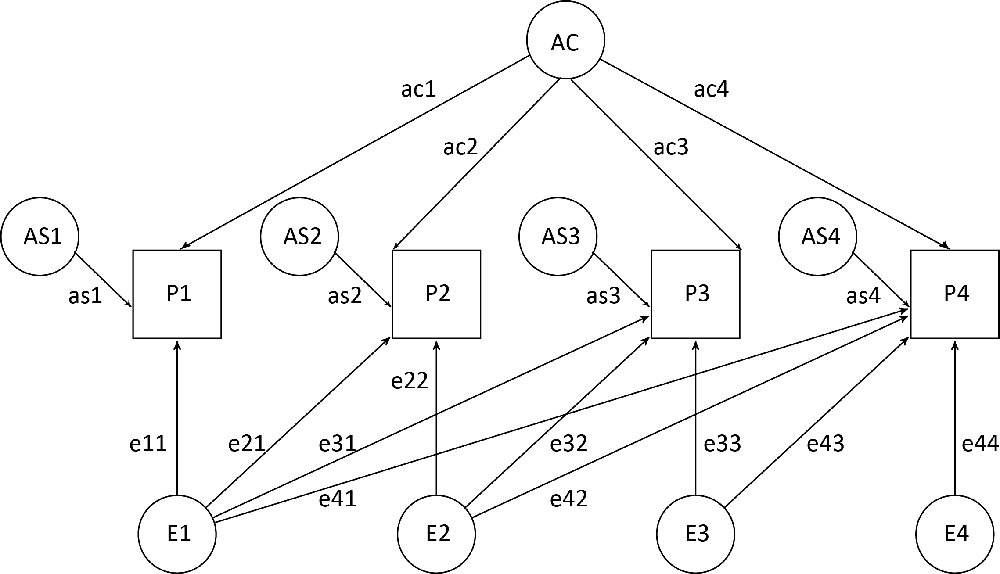

\newcommand{\Cov}{\mathrm{Cov}}
***
# Synopsis
The `grmsem` package is an open-source quantitative genetics tool that supports the modelling of genetic and residual covariance structures in samples of unrelated individuals with genome-wide genotyping information. `grmsem` allows fitting different models describing the underlying multivariate genetic architecture of quantitative traits, as captured by a genetic-relationship-matrix (GRM), using structural equation modelling (SEM) techniques and a maximum likelihood approach (GRM-SEM). Analogous to twin models, the `grmsem` package includes multiple models, such as a `Cholesky decomposition` model, an `Independent Pathway` model and the `Direct Symmetric` model, but also novel models such as a hybrid `Independent Pathway / Cholesky` model. A general form of these models can be automatically fitted. The user can adapt each model by changing the pre-fitted parameters.  All estimates can be obtained in standardised form. Follow-up analyses include estimations of genetic and residual covariance and correlations, bivariate heritabilities, and factorial co-heritabilities and co-environmentalities. `grmsem` replaces the package `gsem`, presented in [@StPourcain2018], because an unrelated package with the same name had been released simultaneously.

<br><br>

# Download and installation
## Package 
The calculations performed by the package `grmsem` are computationally demanding. Hence it is highly recommended to optimise the R software prior to installing the package. This can be done within a Linux environment using OpenBLAS (an optimised Basic Linear Algebra Subsystem library), ATLAS (Automatically Tuned Linear Algebra Software) or the Intel MKL (Math Kernel Library) to improve the performance of basic vector and matrix operations (see [here](https://csantill.github.io/RPerformanceWBLAS/) for further information). The package itself can be installed by standard commands, using either of the two options:

* `install.packages("grmsem")` (latest CRAN release)
* `devtools::install_git('https://gitlab.gwdg.de/beate.stpourcain/grmsem')` (development version)

`grmsem` should be run in parallel by setting the `cores` option of `grmsem.fit()`. Empirically, good performance was achieved with `cores=4`, while sharing memory across as many cores as possible. For this, the entire node should be blocked so that memory across all cores is available for the job (depending on the system ranging usually between 8-24 cores).
Run times and memory requirements for different examples are detailed below.


## Data sets
The `small` data set is already included in the package. All data sets used in this vignette can be downloaded [here](https://gitlab.gwdg.de/beate.stpourcain/grmsem_external).
<br><br>

# Input files
## Genetic relationship matrix
A Genetic Relationship Matrix (GRM) is a symmetric matrix with entries representing the (standardized) number of mutually shared alleles among individuals of a sample. A GRM, consisting of pairs of unrelated individuals (relatedness cut-off $\leq$ 0.05) with genome-wide information, can be estimated using [PLINK](https://www.cog-genomics.org/plink2) or [GCTA](https://cnsgenomics.com/software/gcta/#Overview) software, of which the lower triangle elements are saved in two different forms:

* **grm.gz files:**
The lower triangle GRM elements are generated and saved with the [GCTA](https://cnsgenomics.com/software/gcta/#Overview) `--make-grm-gz` command. `grm.gz` files have no header and contain four columns: indices of pairs of individuals (column 1,2; corresponding to row numbers of grm.id files), number of non-missing SNPs (column 3) and the estimate of genetic relatedness (column 4).  The compressed GRM file (`grm.gz`) can be imported using the `grm.input()` function, specifying the file name in the working directory, and will be returned as symmetric matrix. An example is shown below: 

```{r eval = FALSE}
> G <- grm.input("large.gcta.grm.gz")
> G[1:3,1:3] #Relationships among the first three individuals
           [,1]       [,2]       [,3]
[1,] 0.99354762 0.02328514 0.01644197
[2,] 0.02328514 0.99406837 0.01021175
[3,] 0.01644197 0.01021175 1.02751472
```

* **grm-bin files:**
The lower triangle GRM elements are saved in binary form using the [GCTA](https://cnsgenomics.com/software/gcta/#Overview) `--make-grm-bin` command. The binary `grm.bin` file can be imported using the `grm.bin.input()` function, specifying the file name in the working directory, and will be returned as symmetric matrix. 

## Phenotype file
**Z-standardised** scores are required in form of tables (data frames) with each column representing a different phenotype. The number of columns determines the number of phenotypes **k** in the model. The observations must be **in the same order** as the individuals in the columns/rows of the GRM matrix. This order is shown, for example, in the [GCTA](https://cnsgenomics.com/software/gcta/#Overview) .id file (2-column file: family ID, individual ID).  An example of a quad-variate phenotype is shown below:

```{r eval = FALSE}
> load("ph.large.RData")
> ph.large[1:2,]
             Y1         Y2         Y3         Y4
[1,] -0.7640819 -0.6016908 -0.3981901 -0.3169821
[2,] -0.5099606  0.6671311 -1.3119328 -0.5601261
```
<br><br>

# GREML AE models
Genome-based restricted maximum likelihood (GREML) approaches introduced by @Yang2010a partition the observed phenotypic variation between unrelated individuals into an additive genetic component (A), as captured by genetic markers on a genotyping array, and a remainder (E), analogous to AE twin research methodologies. GREML [@Yang2010a] assumes an underlying "infinitesimal model", a quantitative genetics construct, where each causal locus $i$ from a large number of $m$ causal loci contributes a small additive effect $u_i$ to a phenotype y, reflecting polygenicity. These effect sizes are assumed to follow a normal distribution with variance $\sigma_u^2$. A phenotypic value $y_j$ of an individual $j$ can be predicted by the sum over the (standardised) number of alleles $z_{ij}$ that the individual $j$ carries at locus $i$ multiplied by the (additive) genetic effect $u_i$  at locus $i$

\begin{equation}
y_j=\mu+\sum_{j=1}^m z_{ij}u_i+e_j\;,
(\#eq:lm)
\end{equation}

where, $\mu$ equals the population average that is commonly set to zero, $e_j$ is the residual for individual $j$ and $u_i$ the scaled (additive) effect of alleles at the causal locus $i$.  Additive genetic effects $u_i$  in equation \ref{eq:lm} are treated as random effects, following a normal distribution  $\mathbf{u}\sim N(0,\sigma_u^2)$, where $\sigma_u^2$ is the variance of genetic effects. The residual $e_j$ subsumes other (non-additive genetic, environmental and error) influences on the phenotype of individual $j$, and the residual effects in equation \ref{eq:lm}, too, are assumed to follow a normal distribution with $\mathbf{e}\sim N(0,\sigma^2_e)$. For $n$ individuals, equation \ref{eq:lm} can be re-written in vector notation as

\begin{equation}
\mathbf{y}=\mu+\mathbf{Z}\cdot \mathbf{u}+\mathbf{e}\;
(\#eq:lmmatrix)
\end{equation}

with expected variance 

\begin{equation}
Var(\mathbf{y})=\mathbf{ZZ^\top}\sigma_u^2+\mathbf{I}\sigma_e^2\;
(\#eq:var)
\end{equation}

that is equivalent to $\sigma_p^2=\sigma_g^2+\sigma_e^2$, and reflects, thus, the assumed independence of additive genetic and residual effects. A change of scale by defining $\mathbf{G_c}=\frac{\mathbf{ZZ}^{\top}}{m}$ and $\sigma^2_g=m\sigma_u^2$ yields

\begin{equation}
Var(\mathbf{y})=\mathbf{G_c}\sigma_g^2+\mathbf{I}\sigma_e^2\;, 
(\#eq:vai)
\end{equation}

where $\mathbf{G_c}$ is the genetic relationship matrix (GRM) between pairs of individuals at causal loci [@Yang2010a]. As $m$ is not known, $\mathbf{G_c}$ is approximated using $N$ genome-wide SNPs [@Yang2010a]. Thus, $z_{ij}$ is approximated by $w_{ij}$, the standardised number of alleles that an individual $j$ carries at locus $i$, assuming Hardy-Weinberg equilibrium: 

\begin{equation}
w_{ij}=\frac{x_{ij}-2p_j}{\sqrt{2p_j(1-p_j)}}
(\#eq:wij)
\end{equation}

Here, $p_i$ is the sample frequency of the (arbitrary) reference allele at a locus $i$ and $x_{ij}$ denotes the number of alleles that individual $j$ carries at locus $i$. Hence, $\mathbf{G_c}$ is approximated by $\mathbf{G}$, a GRM constructed from all variants presented on a genome-wide genotyping chip [@Yang2010a], with $\mathbf{G}=\frac{\mathbf{WW}^{\top}}{N}$. Consequently, $\sigma_g^2$ is an estimate of the genetic variance captured by these variants.  

@Yang2010a applied REML, a standard technique of linear mixed model regression, to estimate the parameter $\sigma_g^2$, using genomic-relatedness-based restricted maximum-likelihood (GREML). @Lee2012a extends the GREML approach by @Yang2010a to the bivariate case. 
<br><br>

# Multivariate AE models
The package `grmsem`, presented in [@StPourcain2018] (referred there by its initial name `gsem`), allows

- fitting more than two phenotypic measures
- identifying genetic and residual covariance structures
- evaluating the model fit against saturated models (e.g. `Cholesky decomposition` or `Direct Symmetric` models)

`grmsem` uses a maximum likelihood approach and extends the GREML approach by @Yang2010a to a multivariate case for $k$ traits, setting fixed effect means to zero by use of **z-standardised** phenotypes. We define $Y=\begin{pmatrix}\mathbf{y_1},\mathbf{y_2}, ...,\mathbf{y_k}\end{pmatrix}$ as the $k\cdot n$ observed phenotypic vector of k z-standardised traits of $n$ individuals and denote by $\Sigma_V$ their expected variance $\Sigma_V=Var(Y)$. 

For example, for a quad-variate **z-standardised** trait with $k=4$, a single individual $i$ has information on four phenotypes $y_{i1}$, $y_{i2}$, $y_{i3}$ and $y_{i4}$. Using vector notation, we have for a set of individuals
\begin{align*}
\mathbf{y_1}=\mathbf{W}\mathbf{u_1}+\mathbf{e_1}\\
\mathbf{y_2}=\mathbf{W}\mathbf{u_2}+\mathbf{e_2}\\
\mathbf{y_3}=\mathbf{W}\mathbf{u_3}+\mathbf{e_3}\\
\mathbf{y_4}=\mathbf{W}\mathbf{u_4}+\mathbf{e_4}
\end{align*}

which can be written as a single equation

\begin{equation}
\begin{pmatrix}\mathbf{y_1}\\\mathbf{y_2}\\\mathbf{y_3}\\\mathbf{y_4}\end{pmatrix}=\begin{pmatrix}\mathbf{W} & \mathbf{0} & \mathbf{0} & \mathbf{0}\\ \mathbf{0} & \mathbf{W} & \mathbf{0} & \mathbf{0}
\\ \mathbf{0} & \mathbf{0} & \mathbf{W} & \mathbf{0}\\ \mathbf{0} & \mathbf{0}  & \mathbf{0} & \mathbf{W} \end{pmatrix}\begin{pmatrix}\mathbf{u_1} \\ \mathbf{u_2}\\ \mathbf{u_3} \\ \mathbf{u_4} \\\end{pmatrix}+\begin{pmatrix}\mathbf{e_1}\\\mathbf{e_2}\\\mathbf{e_3}\\\mathbf{e_4}\end{pmatrix}
(\#eq:ydef1)
\end{equation}

with 
\begin{equation}
\begin{split}
\begin{pmatrix}\mathbf{u_1}\\\mathbf{u_2}\\\mathbf{u_3}\\\mathbf{u_4}\end{pmatrix}\sim N\left(\begin{pmatrix}\mathbf{0}\\\mathbf{0}\\\mathbf{0}\\\mathbf{0}\end{pmatrix},\begin{pmatrix}\sigma_{g1}^2&\sigma_{g1g2} &\sigma_{g1g3} &\sigma_{g1g4}\\\sigma_{g1g2}&\sigma_{g2}^2&\sigma_{g2g3} &\sigma_{g2g4} \\\sigma_{g1g3}&\sigma_{g2g3} &\sigma_{g3}^2&\sigma_{g3g4} \\\sigma_{g1g4}&\sigma_{g2g4} &\sigma_{g3g4} &\sigma_{g4}^2 \end{pmatrix}\otimes \mathbf{I}\right)\\
\begin{pmatrix}\mathbf{e_1}\\\mathbf{e_2} \\\mathbf{e_3} \\\mathbf{e_4}\end{pmatrix}\sim N\left(\begin{pmatrix}\mathbf{0}\\\mathbf{0}\\\mathbf{0}\\\mathbf{0}\end{pmatrix},\begin{pmatrix}\sigma_{e1}^2&\sigma_{e1e2} &\sigma_{e1e3} &\sigma_{e1e4}\\\sigma_{e1e2}&\sigma_{e2}^2&\sigma_{e2e3} &\sigma_{e2e4} \\\sigma_{e1e3}&\sigma_{e2e3} &\sigma_{e3}^2&\sigma_{e3e4} \\\sigma_{e1e4}&\sigma_{e2e4} &\sigma_{e3e4} &\sigma_{e4}^2 \end{pmatrix}\otimes \mathbf{I}\right)
\end{split}
(\#eq:norme)
\end{equation}

\noindent Assuming $\Cov(\mathbf{\sigma_{g}},\mathbf{\sigma_{e}})$= $\mathbf{0}$, we can calculate the model implied covariance of

\begin{equation}
\begin{aligned}
\Sigma_V &= \Sigma_A + \Sigma_E \\
&= \begin{pmatrix}\sigma^2_{g1} &  \sigma_{g1g2}  &  \sigma_{g1g3}  &  \sigma_{g1g4}  \\\sigma_{g1g2}  &  \sigma^2_{g2} &  \sigma_{g2g3}  &  \sigma_{g2g4} 
\\\sigma_{g1g3}  & \sigma_{g2g3}  &  \sigma^2_{g3} &  \sigma_{g3g4} 
\\\sigma_{g1g4}  & \sigma_{g2g4}  &  \sigma_{g3g4}  &  \sigma^2_{g4} 
\end{pmatrix}\otimes \mathbf{G} +
\begin{pmatrix}\sigma^2_{e1} &  \sigma_{e1e2} &  \sigma_{e1e3} &  \sigma_{e1e4} \\ \sigma_{e1e2} &  \sigma^2_{e2} &  \sigma_{e2e3} &  \sigma_{e2e4}
\\\sigma_{e1e3} & \sigma_{e2e3} &  \sigma^2_{e3} &  \sigma_{e3e4}
\\\sigma_{e1e4} & \sigma_{e2e4} &  \sigma_{e3e4} &  \sigma^2_{e4} 
\end{pmatrix}\otimes \mathbf{I}\;.
\end{aligned}
(\#eq:4-var)
\end{equation}

The symbol $\otimes$ denotes the *Kronecker product* of two matrices: $\begin{pmatrix}a & b\\c&d\end{pmatrix}\otimes M=\begin{pmatrix}aM & bM\\cM&dM\end{pmatrix}$.

Note that contrary to @Lee2012a, `grmsem` allows for the correlation of residual effects. 

We describe the multivariate structure of $\Sigma_A$ and $\Sigma_E$ by adapting multivariate structural equation modelling methodologies for twin research, originally proposed by @Martin1977, to genomic approaches. Fitting structural models to GRMs, `grmsem` models genetic covariance, $\Sigma_A$, and residual covariance, $\Sigma_E$, by defining factor structures as specified by genetic and residual factor loadings in $\Lambda_A$ and $\Lambda_E$ matrices respectively. 

\begin{equation}
\Sigma_V=\Lambda_A\mathbf{G}\Lambda_A^\top+\Lambda_E\mathbf{I}\Lambda_E^\top\;.
 (\#eq:gsemvar)
\end{equation}

The user can select $\Lambda_A$ and $\Lambda_E$ according to pre-specified model structures, including the models

- Cholesky decomposition 
- Independent Pathway (IP)
- Hybrid Independent Pathway / Cholesky (IPC)

by setting the `model` option of `grmsem.fit()` to `Cholesky`, `IP` or `IPC` respectively. In addition, the Cholesky model can be re-parametrised as 

- Direct Symmetric (DS)

model, estimating genetic and residual covariances directly, using the `model` option `DS`. `grmsem` fits, like GREML, all available data to the model. Each model can be adapted by the user by setting free parameters and starting values. Although $k$, the number of different phenotypes is not restricted, in principle, computational demands will typically set a limit based on $k\cdot n\approx30,000$ for Cholesky decomposition models; models using fewer parameters can handle larger $k\cdot n$. 

<br><br>

# Model descriptions
## Cholesky model
The Cholesky decomposition model is a fully parametrised descriptive model without any explicit boundaries on the structure of latent genetic and residual influences that can provide higly informative insight into the developmental architecture of quantitative traits. The Cholesky model can be fit to the data through decomposition of both the genetic variance and residual variance into as many factors A and E as there are observed phenotypes $k$ (\ref{eq:choleskycov}). However, model coefficients can only be interpreted, if there is an inherent longitudinal order of measured phenotypes that is reflected in the order of phenotypes entered in the model. The first phenotype should represent the earliest measured trait. In general, a Cholesky model has $k(k+1)/2$ genetic parameters $a_{11},a_{21},...,a_{kk}$ and $k(k+1)/2$ residual parameters $e_{11},e_{21},...,e_{kk}$.
An example of a quad-variate ($k=4$) Cholesky decomposition model is shown in Figure \@ref(fig:path-cholesky), with $\Lambda$ parameters

\begin{equation}
\Lambda_A=\begin{pmatrix}a_{11} & 0 & 0 & 0\\a_{21} &a_{22} & 0& 0\\ a_{31} &a_{32} &a_{33} & 0\\ a_{41} &a_{42} &a_{43} &a_{44}\end{pmatrix}\;,\quad \Lambda_E=\begin{pmatrix}e_{11} & 0 & 0 & 0\\e_{21} &e_{22} & 0& 0\\ e_{31} &e_{32} &e_{33} & 0\\ e_{41} &e_{42} &e_{43} &e_{44}\end{pmatrix}
(\#eq:choleskylambda)
\end{equation}

and expected covariance matrices 

\begin{equation}
\begin{split}
\Sigma_A&=\begin{pmatrix}
a_{11}^2 & a_{11}a_{21} & a_{11}a_{31} & a_{11}a_{41}\\
a_{11}a_{21} & a_{21}^2+a_{22}^2 & a_{21}a_{31}+a_{22}a_{32} & a_{21}a_{41}+a_{22}a_{42}\\
a_{11}a_{31} & a_{21}a_{31}+a_{22}a_{32} & a_{31}^2+a_{32}^2 +a_{33}^2& a_{31}a_{41}+a_{32}a_{42}+a_{33}a_{43}\\
a_{11}a_{41} & a_{21}a_{41}+a_{22}a_{42} & a_{31}a_{41}+a_{32}a_{42}+a_{33}a_{43}&  a_{41}^2+a_{42}^2+a_{43}^2 +a_{44}^2 \end{pmatrix}\otimes \mathbf{G}\\
\Sigma_E&=\begin{pmatrix}
e_{11}^2 & e_{11}e_{21} & e_{11}e_{31} & e_{11}e_{41}\\
e_{11}e_{21} & e_{21}^2+e_{22}^2 & e_{21}e_{31}+e_{22}e_{32} & e_{21}e_{41}+e_{22}e_{42}\\
e_{11}e_{31} & e_{21}e_{31}+e_{22}e_{32} & e_{31}^2+e_{32}^2 +e_{33}^2& e_{31}e_{41}+e_{32}e_{42}+e_{33}e_{43}\\
e_{11}e_{41} & e_{21}e_{41}+e_{22}e_{42} & e_{31}e_{41}+e_{32}e_{42}+e_{33}e_{43}&  e_{41}^2+e_{42}^2+e_{43}^2 +e_{44}^2\\ \end{pmatrix}\otimes \mathbf{I}
\end{split}
(\#eq:choleskycov)
\end{equation}

<br><br>
```{r path-cholesky, echo=FALSE, out.width="65%", fig.align='center', fig.cap="Quad-variate Cholesky decomposition model. Observed phenotypes (P) are represented by squares and factors by circles. Single-headed arrows (paths) define relationships between variables. The variance of latent variables is constrained to unit variance; this is omitted from the path diagram to improve clarity."}

```

<br><br>

## Independent Pathway model
The Independent Pathway model specifies a common latent genetic factor (A) and a common latent residual factor (E), in addition to trait-specific genetic influences (AS) and trait-specific residual influences (ES) (\ref{eq:ipcov}). In general, this model has $2k$ genetic parameters $a_{c1},...,a_{ck},a_{s1},...,a_{sk}$ and $2k$ residual parameters $e_{c1},...,e_{ck},e_{s1},...,e_{sk}$. An example of a quad-variate ($k=4$) Independent Pathway model is shown in Figure \@ref(fig:path-indep), with $\Lambda$ parameters

\begin{equation}
\Lambda_A=
\begin{pmatrix}a_{c1} & a_{s1} & 0& 0& 0\\a_{c2} & 0 & a_{s2}& 0& 0\\a_{c3} & 0  & 0 &a_{s3}& 0 \\ a_{c4} & 0  & 0 & 0 &a_{s4}\end{pmatrix}\;,\quad \Lambda_E=\begin{pmatrix}e_{c1} & e_{s1} & 0& 0& 0\\e_{c2} & 0 & e_{s2}& 0& 0\\e_{c3} & 0  & 0 &e_{s3}& 0 \\ e_{c4} & 0  & 0 & 0 &e_{s4}\end{pmatrix}
(\#eq:iplambda)
\end{equation}

and expected covariance matrices 

\begin{equation}
\begin{split}
\Sigma_A&=\begin{pmatrix}
a_{c1}^2+a_{s1}^2 & a_{c1}a_{c2} & a_{c1}a_{c3} & a_{c1}a_{c4}\\
a_{c1}a_{c2} & a_{c2}^2+a_{s2}^2 & a_{c2}a_{c3} & a_{c2}a_{c4}\\
a_{c1}a_{c3} & a_{c2}a_{c3} & a_{c3}^2+a_{s3}^2 & a_{c3}a_{c4}\\
a_{c1}a_{c4} & a_{c2}a_{c4} & a_{c3}a_{c4} & a_{c4}^2+a_{s4}^2
\end{pmatrix}\otimes \mathbf{G}\\
\Sigma_E&=\begin{pmatrix}
e_{c1}^2+e_{s1}^2 & e_{c1}e_{c2} & e_{c1}e_{c3} & e_{c1}e_{c4}\\
e_{c1}e_{c2} & e_{c2}^2+e_{s2}^2 & e_{c2}e_{c3} & e_{c2}e_{c4}\\
e_{c1}e_{c3} & e_{c2}e_{c3} & e_{c3}^2+e_{s3}^2 & e_{c3}e_{c4}\\
e_{c1}e_{c4} & e_{c2}e_{c4} & e_{c3}e_{c4} & e_{c4}^2+e_{s4}^2
\end{pmatrix}\otimes \mathbf{I}
\end{split}
(\#eq:ipcov)
\end{equation}

<br><br>
```{r path-indep, echo = FALSE, out.width="65%", fig.align='center', fig.cap="Quad-variate Independent Pathway model. Observed phenotypes (P) are represented by squares and factors by circles. Single-headed arrows (paths) define relationships between variables. The variance of latent variables is constrained to unit variance; this is omitted from the path diagram to improve clarity."}

```

<br><br>

## IPC model
The hybrid Independent Pathway / Cholesky decomposition (IPC) model (\ref{eq:ipccov}) structures the genetic variance as an Independent Pathway model, consisting of a common factor (A) and measurement-specific influences (AS), while the residual variance is structured as a Cholesky decomposition model, where the number of factors (E) is the same as the number of observed variables ($k$). In general, this model has $2k$ genetic parameters $a_{c1},...,a_{ck},a_{s1},...,a_{sk}$ and $k(k+1)/2$ residual parameters $e_{11},e_{21},...,e_{kk}$. An example of a quad-variate ($k=4$) IPC model is shown in Figure \@ref(fig:path-ipc)), with $\Lambda$ parameters

\begin{equation}
\Lambda_A=
\begin{pmatrix}a_{c1} & a_{s1} & 0& 0& 0\\a_{c2} & 0 & a_{s2}& 0& 0\\a_{c3} & 0  & 0 &a_{s3}& 0 \\ a_{c4} & 0  & 0 & 0 &a_{s4}\end{pmatrix}\;,\quad \Lambda_E=\begin{pmatrix}e_{11} & 0 & 0 & 0\\e_{21} &e_{22} & 0& 0\\ e_{31} &e_{32} &e_{33} & 0\\ e_{41} &e_{42} &e_{43} &e_{44}\end{pmatrix}
(\#eq:ipclambda)
\end{equation}

and expected covariance matrices 

\begin{equation}
\begin{split}
\Sigma_A&=\begin{pmatrix}
a_{c1}^2+a_{s1}^2 & a_{c1}a_{c2} & a_{c1}a_{c3} & a_{c1}a_{c4}\\
a_{c1}a_{c2} & a_{c2}^2+a_{s2}^2 & a_{c2}a_{c3} & a_{c2}a_{c4}\\
a_{c1}a_{c3} & a_{c2}a_{c3} & a_{c3}^2+a_{s3}^2 & a_{c3}a_{c4}\\
a_{c1}a_{c4} & a_{c2}a_{c4} & a_{c3}a_{c4} & a_{c4}^2+a_{s4}^2
\end{pmatrix}\otimes \mathbf{G}\\
\Sigma_E&=\begin{pmatrix}
e_{11}^2 & e_{11}e_{21} & e_{11}e_{31} & e_{11}e_{41}\\
e_{11}e_{21} & e_{21}^2+e_{22}^2 & e_{21}e_{31}+e_{22}e_{32} & e_{21}e_{41}+e_{22}e_{42}\\
e_{11}e_{31} & e_{21}e_{31}+e_{22}e_{32} & e_{31}^2+e_{32}^2 +e_{33}^2& e_{31}e_{41}+e_{32}e_{42}+e_{33}e_{43}\\
e_{11}e_{41} & e_{21}e_{41}+e_{22}e_{42} & e_{31}e_{41}+e_{32}e_{42}+e_{33}e_{43}&  e_{41}^2+e_{42}^2+e_{43}^2 +e_{44}^2 \end{pmatrix}\otimes\mathbf{I}
\end{split}
(\#eq:ipccov)
\end{equation}

<br><br>
```{r path-ipc, echo = FALSE, out.width="65%", fig.align='center', fig.cap="Quad-variate IPC model. Observed phenotypes (P) are represented by squares and factors by circles. Single-headed arrows (paths) define relationships between variables. The variance of latent variables is constrained to unit variance; this is omitted from the path diagram to improve clarity."}

```

<br><br>

## Direct Symmetric model
The Direct Symmetric model is a saturated variance component-based model, mathematically equivalent to the Cholesky decomposition model. It is a fully parametrised descriptive model and without any explicit or implicit boundaries, allowing for negative variance estimations [@Verhulst2019]. The model estimates genetic and residual variances and covariances, as outlined in equation \ref{eq:4-dsvar}, irrespective of the order of the phenotypes, but without providing insight into developmental genetic architectures, as captured by the Cholesky decomposition model. `grmsem` model comparisons between the Cholesky decomposition and the Direct Symmetric model have, so far, revealed no discernable differences in loglikelihood or estimated parameters (see below), when studying heritable traits. However, we advise the user to always fit a Direct Symmetric model to confirm unbiased likelihood estimations. In general, the Direct Symmetric model has $k(k+1)/2$ genetic parameters $A_{11},A_{21},...,A_{kk}$ and $k(k+1)/2$ residual parameters $E_{11},E_{21},...,E_{kk}$, where the indices of each variance component are interchangeable. For identification, the factor loadings are fixed to unity.

Example of a quad-variate Direct Symmetric model ($k=4$) with a model implied covariance of 
\begin{equation}
\begin{aligned}
\Sigma_V &= \begin{pmatrix} A_{11} &  A_{21}  &  A_{31}  &  A_{41}  \\A_{21}  &  A_{22} &  A_{32}  &  A_{42} 
\\ A_{31}  & A_{32}  &  A_{33} &  A_{43} 
\\ A_{41}  & A_{42}  &  A_{43}  &  A_{44} 
\end{pmatrix}\otimes \mathbf{G} +
\begin{pmatrix} E_{11} &  E_{21} &  E_{31} &  E_{41} \\ E_{21} &  E_{22} &  E_{32} &  E_{42}
\\ E_{31} & E_{32} &  E_{33} &  E_{43}
\\ E_{41} & E_{42} &  E_{43} &  E_{44} 
\end{pmatrix}\otimes \mathbf{I}\;.
\end{aligned}
(\#eq:4-dsvar)
\end{equation}

# Estimation
From standard SEM theory it follows that the model parameter vector $\mathbf{\theta}$ of either $\Lambda_A$ and $\Lambda_E$ (Cholesky, IP, IPC models) or $\Sigma_A$ and $\Sigma_E$ (DS model), can be estimated by maximising the following log-likelihood function (omitting a constant term  $- \frac{nk}{2} \log{2\pi}$) across n Gaussians for all n individuals:

\begin{equation}
l(\theta)=-\frac{n}{2}log|\Sigma_V|-\sum_{j=1}^{n} \frac{1}{2}Y^\top \Sigma_V^{-1}Y\;.
(\#eq:ll)
 \end{equation}
From general ML theory it follows that the variance of the parameters can be estimated using the information matrix. For any parameter $\theta$ it holds
\begin{equation}
Var(\theta) =\left[-\left(\frac{\partial^2 l(\theta)}{\partial \theta^2}\right)\Bigg\rvert_{\theta=\hat\theta}\right]^{-1}\;.
 (\#eq:llvar)
 \end{equation}
The estimation of parameters and their SEs is performed by the function `grmsem.fit()`. Specifically, the loglikelihood is estimated with `stats::optim()` and the BFGS approach and $Var(\theta)$ with `numDeriv::hessian()`. Using the `grmsem.fit()` output, the function `grmsem.var()` returns the matrices $\Lambda_A\Lambda_A^\top$ and $\Lambda_E\Lambda_E^\top$ (Cholesky, IP, IPC models) which yield the phenotopic variance explained by the various factors. Bivariate simulations comparing OpenMx, GRM-SEM and GCTA GREML can be found in [@StPourcain2018], Supplementary Table S3. Otherwise, the `grmsem.fit()` output returns the directly estimated $\Sigma_A$ and $\Sigma_E$ matrices (DS model) and their SEs.

Different to twin-models, `grmsem` models allow for an estimation of genetic and residual variances and covariances (AE), as E in GRM-related methods for unrelated individuals may capture both shared and unique residual influences. `grmsem` estimates the statistical significance of estimated parameters directly, using a Wald test, assuming multivariate normality. 

The returned `grmsem.fit` object can be used to estimate genetic and residual covariance and correlations (`grmsem.var` function), bivariate heritabilities (`grmsem.biher` function), and factorial co-heritabilities and co-environmentalities (`grmsem.fcoher` function). Listwise complete observations can be selected with the option `compl.ph` `TRUE`. Otherwise, `grmsem.fit` fits, like GREML, all available data to the model with the default option `compl.ph` `FALSE`.

<br><br>

# Examples
## Outline
Multivariate models with `grmsem` are time-consuming, especially with large numbers of observations per trait. To illustrate the functionality of `grmsem` follow-up analyses, we fitted two saturated models (`Cholesky decomposition` and `DS`) to two different data sets:

* A `small` simulated tri-variate toy data set that allows fitting the model on the fly. 
* A `large` multivariate quad-variate data set with defined genetic architecture. 

Simulated data sets used in the vignette can be downloaded [here](https://gitlab.gwdg.de/beate.stpourcain/grmsem_external).

Recent multivariate analysis of real data can be found in [@Verhoef2020] and [@Shapland2020].

<br>

## Tri-variate example
### Data simulation
For quick demonstration purposes, a small tri-variate toy data set was simulated, assuming an underlying Cholesky model with 100 observations per trait and low polygenicity (150 SNPs per genetic factor), and the following genetic (`lambda_A`) and residual  (`lambda_E`) factor loadings:

\begin{equation}
\Lambda_A=\begin{pmatrix} \sqrt{0.3} & 0 & 0\\ \sqrt{0.2} & \sqrt{0.4} & 0\\ \sqrt{0.2} & \sqrt{0.2} & \sqrt{0.3}\end{pmatrix}\;,\quad \Lambda_E=\begin{pmatrix} \sqrt{0.7} & 0 & 0\\ \sqrt{0.1} & \sqrt{0.3} & 0\\ \sqrt{0.2} & \sqrt{0.1} & \sqrt{0.1}\end{pmatrix}
(\#eq:simsmall)
\end{equation}

\begin{equation}
\Sigma_A=\begin{pmatrix} 0.300 & 0.245 & 0.245\\ 0.245 & 0.600 & 0.483\\ 0.245 & 0.483 & 0.600\end{pmatrix}\;,\quad \Sigma_E=\begin{pmatrix} 0.700 & 0.265 & 0.374\\  0.265 & 0.400 & 0.315\\ 0.374 & 0.315 & 0.400\end{pmatrix}
(\#eq:simsmallvar)
\end{equation}


The small GRM data file (`G.small.RData`) and the phenotype file (`ph.small.RData`) are included in the grmsem package, but can also be downloaded from [here](https://gitlab.gwdg.de/beate.stpourcain/grmsem_external). 

Performance: Fitting a Cholesky decomposition model (6 genetic and 6 residual parameters) to the data using 4 cores, sharing memory across 24 cores, required ~11s using R MKL 3.6.3. Fitting the models under Windows10 with 1 core required ~15s using 3.6.3. A pre-fitted Cholesky output has been also saved to (`fit.small.RData`). For comparison, also the Direct Symmetric model has been fitted, which had a similar performance. Note that some output has been omitted for clarity. 

<br>

### Cholesky model
Here, we fit a Cholesky decomposition model (6 genetic and 6 residual parameters) to the `small` simulated data set, on the fly, with the following model fit and estimated parameters: 

```{r eval = FALSE}
#If files were downloaded externally, please load here:
> load("G.small.RData")
> load("ph.small.RData")
> fit <- grmsem.fit(ph.small,
                    G.small,
                    model="Cholesky",
                    LogL=TRUE,
                    estSE=TRUE)
> fit
$model.in
   part label      value freepar
1     a   a11  0.6971323       1
2     a   a21 -0.2357364       1
3     a   a31  0.3048627       1
4     a   a22  0.2067668       1
5     a   a32 -0.3823634       1
6     a   a33 -0.1557505       1
7     e   e11 -0.4958634       1
8     e   e21 -0.5924593       1
9     e   e31  0.1700410       1
10    e   e22  0.3570643       1
11    e   e32 -0.3220280       1
12    e   e33  0.5024512       1

$model.fit$LL
[1] -54.39143

$model.out
   label  estimates      gradient         se         Z            p
1    a11 -0.5618594 -4.490283e-05 0.18730897 -2.999640 2.702993e-03
2    a21 -0.5172780  6.160157e-05 0.25150203 -2.056755 3.970982e-02
3    a31 -0.6022167 -4.596719e-05 0.20040106 -3.005057 2.655308e-03
4    a22 -0.7791023 -1.154262e-05 0.13696258 -5.688432 1.282113e-08
5    a32 -0.3313097  6.118543e-05 0.14755775 -2.245289 2.474961e-02
6    a33 -0.4201447  7.389654e-05 0.07000431 -6.001697 1.952654e-09
7    e11 -0.8266200  2.460492e-04 0.11621420 -7.112900 1.136299e-12
8    e21 -0.2344285 -1.605268e-04 0.12464049 -1.880838 5.999398e-02
9    e31 -0.4124524  6.209974e-05 0.12534761 -3.290469 1.000207e-03
10   e22  0.3862229 -2.636815e-05 0.12634091  3.056990 2.235717e-03
11   e32  0.3410509  8.582604e-05 0.10625220  3.209824 1.328162e-03
12   e33 -0.2511355  1.911040e-04 0.05125420 -4.899803 9.593276e-07

$k
[1] 3

$n
[1] 300

$n.obs
[1] 100 100 100

$n.ind
[1] 100

$model
[1] "Cholesky"
```

Here, we derive genetic variance and correlations:

```{r eval = FALSE}
> var.fit <- grmsem.var(fit)
> print(var.fit)
$VA
           1         2         3
Y1 0.3156860 0.2906375 0.3383611
Y2 0.2906375 0.8745770 0.5696376
Y3 0.3383611 0.5696376 0.6489526

$VA.se
           1         2         3
Y1 0.2104826 0.1832943 0.1850112
Y2 0.1832943 0.2583423 0.2220882
Y3 0.1850112 0.2220882 0.2227517

$VE
           1         2         3
Y1 0.6833006 0.1937833 0.3409414
Y2 0.1937833 0.2041249 0.2284123
Y3 0.3409414 0.2284123 0.3495017

$VE.se
           1         2         3
Y1 0.1921300 0.1180125 0.1387263
Y2 0.1180125 0.1269780 0.1222845
Y3 0.1387263 0.1222845 0.1373590

$VP
           1         2         3
Y1 0.9989866 0.4844208 0.6793025
Y2 0.4844208 1.0787019 0.7980499
Y3 0.6793025 0.7980499 0.9984543

$RG
           1         2         3
Y1 1.0000000 0.5531272 0.7475604
Y2 0.5531272 1.0000000 0.7561242
Y3 0.7475604 0.7561242 1.0000000

$RG.se
           1          2            3
Y1 0.0000000 0.22348027 1.575650e-01
Y2 0.2234803 0.00000000 8.697161e-02
Y3 0.1575650 0.08697161 4.449797e-17

$RE
           1         2         3
Y1 1.0000000 0.5188747 0.6976686
Y2 0.5188747 1.0000000 0.8551589
Y3 0.6976686 0.8551589 1.0000000

$RE.se
              1            2            3
Y1 5.160947e-17 2.051003e-01 1.173883e-01
Y2 2.051003e-01 5.610664e-17 8.730948e-02
Y3 1.173883e-01 8.730948e-02 2.359273e-17

```
<br>

Here, we derive the standardised parameters:
 
```{r eval = FALSE}
> print(st.fit)
$stand.model.out
   label stand.estimates   stand.se         Z            p
1    a11      -0.5621443 0.17186763 -3.270798 1.072444e-03
2    a21      -0.4980504 0.22959865 -2.169222 3.006584e-02
3    a31      -0.6026826 0.17316262 -3.480443 5.005852e-04
4    a22      -0.7501425 0.12682263 -5.914895 3.320880e-09
5    a32      -0.3315661 0.14661954 -2.261404 2.373422e-02
6    a33      -0.4204698 0.07358378 -5.714164 1.102447e-08
7    e11      -0.8270392 0.11681963 -7.079625 1.445454e-12
8    e21      -0.2257147 0.12967922 -1.740562 8.176046e-02
9    e31      -0.4127715 0.13122602 -3.145500 1.658030e-03
10   e22       0.3718667 0.14164900  2.625269 8.658054e-03
11   e32       0.3413148 0.11390419  2.996507 2.730917e-03
12   e33      -0.2513298 0.05457774 -4.604987 4.124919e-06

```

and the standardised variances (heritability and environmentality):

```{r eval=FALSE}
> st.var.fit <- grmsem.var(st.fit)
> print(st.var.fit)
$VA
           1         2         3
Y1 0.3160062 0.2799762 0.3387946
Y2 0.2799762 0.8107680 0.5488882
Y3 0.3387946 0.5488882 0.6499573

$VA.se
           1         2         3
Y1 0.1932288 0.1619891 0.1613852
Y2 0.1619891 0.1379212 0.1565957
Y3 0.1613852 0.1565957 0.1544661

$VE
           1         2         3
Y1 0.6839938 0.1866749 0.3413782
Y2 0.1866749 0.1892320 0.2200922
Y3 0.3413782 0.2200922 0.3500427

$VE.se
           1         2         3
Y1 0.1932288 0.1218645 0.1436571
Y2 0.1218645 0.1379212 0.1334911
Y3 0.1436571 0.1334911 0.1544661

$VP
           1         2         3
Y1 1.0000000 0.4666511 0.6801728
Y2 0.4666511 1.0000000 0.7689803
Y3 0.6801728 0.7689803 1.0000000

$RG
           1         2         3
Y1 1.0000000 0.5531272 0.7475604
Y2 0.5531272 1.0000000 0.7561242
Y3 0.7475604 0.7561242 1.0000000

$RG.se
           1          2            3
Y1 0.0000000 0.23210789 1.574432e-01
Y2 0.2321079 0.00000000 8.945803e-02
Y3 0.1574432 0.08945803 1.633888e-17

$RE
           1         2         3
Y1 1.0000000 0.5188747 0.6976686
Y2 0.5188747 1.0000000 0.8551589
Y3 0.6976686 0.8551589 1.0000000

$RE.se
           1            2            3
Y1 0.0000000 2.130183e-01 1.172975e-01
Y2 0.2130183 6.290479e-17 8.880531e-02
Y3 0.1172975 8.880531e-02 5.827606e-17
```
<br>

### DS model
For comparison, we fit a Direct Symmetric model and obtain a near-identical fit (loglikelihood).

```{r eval=FALSE}
> fit.DS <- grmsem.fit(ph.small,
                       G.small,
                       model="DS",
                       LogL=TRUE,
                       estSE=TRUE)
[1] 300
[1] 100 100 100
[1]   1 101 201
[1] 100 200 300
[1] "Parameters for a direct symmetric model (variance components):"
[1] "Vector of genetic variances:"
[1] "A11" "A21" "A31" "A22" "A32" "A33"
[1] "Vector of residual factor loadings:"
[1] "E11" "E21" "E31" "E22" "E32" "E33"

> fit.DS
$model.in
   part label     value freepar
1     a   A11 1.0000000       1
2     a   A21 0.4602739       1
3     a   A31 0.6738565       1
4     a   A22 1.0000000       1
5     a   A32 0.7527887       1
6     a   A33 1.0000000       1
7     e   E11 1.0000000       1
8     e   E21 0.4602739       1
9     e   E31 0.6738565       1
10    e   E22 1.0000000       1
11    e   E32 0.7527887       1
12    e   E33 1.0000000       1

$model.fit$LL
[1] -54.39145

$model.fit$calls
function gradient 
     122       26 

$model.fit$convergence
[1] 0

$model.fit$message
NULL


$model.out
   label estimates      gradient        se        Z            p
1    A11 0.3161061  0.0009860302 0.2106008 1.500972 0.1333627052
2    A21 0.2912542  0.0039066047 0.1834675 1.587497 0.1124001236
3    A31 0.3389444 -0.0036802953 0.1852176 1.829979 0.0672530362
4    A22 0.8754990  0.0025629175 0.2584953 3.386905 0.0007068577
5    A32 0.5705239 -0.0051792201 0.2222947 2.566520 0.0102724710
6    A33 0.6497819  0.0048300247 0.2229978 2.913849 0.0035700307
7    E11 0.6828573  0.0009099445 0.1921358 3.554035 0.0003793684
8    E21 0.1932362  0.0081933028 0.1180255 1.637241 0.1015800561
9    E31 0.3403784 -0.0046169601 0.1387849 2.452561 0.0141843201
10   E22 0.2034536  0.0015010666 0.1268743 1.603584 0.1088057273
11   E32 0.2277079  0.0414495710 0.1222574 1.862529 0.0625285683
12   E33 0.3487737  0.0049090361 0.1373909 2.538551 0.0111312504

$k
[1] 3

$n
[1] 300

$n.obs
[1] 100 100 100

$n.ind
[1] 100

$model
[1] "DS"
```

Similarly, the variance parameter estimates and SEs for the Direct Symmetric model are near-identical to those derived for the Cholesky decomposition model.

```{r eval=FALSE}
> var.fit.ds <- grmsem.var(fit.DS)
> var.fit.ds
$VA
           1         2         3
Y1 0.3161061 0.2912542 0.3389444
Y2 0.2912542 0.8754990 0.5705239
Y3 0.3389444 0.5705239 0.6497819

$VA.se
           1         2         3
Y1 0.2106008 0.1834675 0.1852176
Y2 0.1834675 0.2584953 0.2222947
Y3 0.1852176 0.2222947 0.2229978

$VE
           1         2         3
Y1 0.6828573 0.1932362 0.3403784
Y2 0.1932362 0.2034536 0.2277079
Y3 0.3403784 0.2277079 0.3487737

$VE.se
           1         2         3
Y1 0.1921358 0.1180255 0.1387849
Y2 0.1180255 0.1268743 0.1222574
Y3 0.1387849 0.1222574 0.1373909

$VP
           1         2         3
Y1 0.9989633 0.4844903 0.6793228
Y2 0.4844903 1.0789526 0.7982318
Y3 0.6793228 0.7982318 0.9985556

$RG
           1         2         3
Y1 1.0000000 0.5536406 0.7478738
Y2 0.5536406 1.0000000 0.7564186
Y3 0.7478738 0.7564186 1.0000000

$RG.se
           1          2          3
Y1 0.0000000 0.22323218 0.15738360
Y2 0.2232322 0.00000000 0.08684325
Y3 0.1573836 0.08684325 0.00000000

$RE
           1         2         3
Y1 1.0000000 0.5184307 0.6974693
Y2 0.5184307 1.0000000 0.8548176
Y3 0.6974693 0.8548176 1.0000000

$RE.se
           1          2          3
Y1 0.0000000 0.20548054 0.11753303
Y2 0.2054805 0.00000000 0.08761989
Y3 0.1175330 0.08761989 0.00000000
```
<br>

## Quad-variate example
### Data simulation
A large quad-variate data set was simulated, assuming an underlying Cholesky model, with 5000 observations per trait and high polygenicity (5,000 SNPs per genetic factor), and the following genetic (`lambda_A`) and residual  (`lambda_E`) factor loadings:

\begin{equation}
\Lambda_A=\begin{pmatrix}\sqrt{0.3} & 0 & 0 & 0\\ \sqrt{0.2} & \sqrt{0.4} & 0& 0\\ \sqrt{0.2} & \sqrt{0.2} & \sqrt{0.2} & 0\\ \sqrt{0.1} & \sqrt{0.2} &0 & \sqrt{0.4}\end{pmatrix}\;,\quad \Lambda_E=\begin{pmatrix}\sqrt{0.7} & 0 & 0 & 0\\ \sqrt{0.1} & \sqrt{0.3} & 0& 0\\ \sqrt{0.2} & 0 & \sqrt{0.2} & 0\\  0 & 0  & 0 & \sqrt{0.3}\end{pmatrix}
(\#eq:simlarge)
\end{equation}

\begin{equation}
\Sigma_A=\begin{pmatrix} 0.300 & 0.245 & 0.245 & 0.173\\ 0.245 & 0.600 & 0.483 & 0.424\\ 0.245 & 0.483 & 0.600 & 0.341\\ 0.173 & 0.424 &0.341 & 0.700 \end{pmatrix}\;,\quad \Sigma_E=\begin{pmatrix}0.700 & 0.265 & 0.374 & 0.000\\ 0.265 & 0.400 & 0.141& 0.000\\ 0.374 & 0.141 & 0.400 & 0.000\\  0.000 & 0.000  & 0.000 & 0.300 \end{pmatrix}
(\#eq:simlargevar)
\end{equation}

The Cholesky model was pre-fitted and saved (`fit.large.RData`) to illustrate `grmsem` follow-up functions. The large GRM data file (`G.large.RData`), the phenotype file (`ph.large.RData`) and the pre-fitted output file (`fit.large.RData`) can be downloaded from [here](https://gitlab.gwdg.de/beate.stpourcain/grmsem_external). The phenotype file and the pre-fitted Cholesky output file have also been included in the package. For completeness, also the fit of a Direct Symmetric model is shown. Note that some output has been omitted for clarity. 

Performance: Fitting both a Cholesky decomposition model (10 genetic and 10 residual parameters) and a Direct Symmetric model (10 genetic and 10 residual variances and covariances) to the data including a VCOV estimation for variances and covariances among all parameters, using 4 cores and sharing memory across 24 cores, required ~21h using R MKL 3.6.3 (Cholesky model: 21h2m, Direct Symmetric model: 21h24m, vmmax of 17.3 Gb RAM each). For comparison, using otherwise similar conditions, fitting an IPC model required 11h48m, and fitting an Independent Pathway model 10h14m (data not shown). However, note that this performance is based on simulated data without missing values (listwise complete data option `compl.ph` `TRUE`). RAM requirements (but not time) will increase for data with missingness patterns (listwise complete data option `compl.ph` `FALSE`) and models will require, under similar conditions, ~ 70 Gb RAM.  

<br>

### Cholesky model 
We fit a quad-variate Cholesky decomposition model (10 genetic and 10 residual variances) with the following model fit and estimated parameters:

```{r eval = FALSE}
#Do not run!
#Please downloaded externally
#load("G.large.RData")
#load("ph.large.RData")
#fit <- grmsem.fit(ph.large,
#                 G.large,model="Cholesky",
#                 LogL=TRUE,
#                 estSE=TRUE)

> load("fit.large.RData")
> fit.large
$model.in
   part label       value freepar
1     a   a11  0.01686961       1
2     a   a21  0.75022252       1
3     a   a31 -0.10352849       1
4     a   a41 -0.81445295       1
5     a   a22 -0.34964589       1
6     a   a32  0.70013464       1
7     a   a42  0.30439698       1
8     a   a33  0.87503509       1
9     a   a43 -0.37434617       1
10    a   a44  0.86376688       1
11    e   e11 -0.28008894       1
12    e   e21 -0.92449828       1
13    e   e31 -0.72312602       1
14    e   e41 -0.70924504       1
15    e   e22  0.51178943       1
16    e   e32  0.66207502       1
17    e   e42 -0.64331456       1
18    e   e33  0.16870994       1
19    e   e43  0.30222504       1
20    e   e44  0.21833386       1

$model.fit$LL
[1] -4556.647

$model.fit$calls
function gradient 
     488      118 

$model.fit$convergence
[1] 0

$model.fit$message
NULL

$model.out
   label    estimates      gradient          se           Z             p
1    a11 -0.590283919  7.196924e-03 0.018936941 -31.1710286 2.632163e-213
2    a21 -0.406228554  4.760323e-04 0.022331488 -18.1908415  6.099640e-74
3    a31 -0.412282704 -1.306064e-03 0.021811928 -18.9017085  1.104185e-79
4    a41 -0.251181508  4.515862e-03 0.025355870  -9.9062469  3.910610e-23
5    a22 -0.611871764  7.519419e-03 0.013081543 -46.7736703  0.000000e+00
6    a32 -0.412494347  5.020765e-05 0.015153798 -27.2205248 3.712770e-163
7    a42 -0.406496327  2.858898e-03 0.020248170 -20.0757069  1.203583e-89
8    a33  0.443344860 -2.806537e-04 0.013549030  32.7215213 7.719589e-235
9    a43 -0.015668913  1.437494e-03 0.024698450  -0.6344088  5.258141e-01
10   a44  0.655953940 -5.747793e-03 0.014789225  44.3535029  0.000000e+00
11   e11 -0.794244501  2.325624e-02 0.012513836 -63.4693048  0.000000e+00
12   e21 -0.290249172 -8.449568e-04 0.013042715 -22.2537381 1.037729e-109
13   e31 -0.445243952 -5.908758e-03 0.012154714 -36.6313812 9.056960e-294
14   e41  0.006719942  7.527450e-03 0.011697368   0.5744833  5.656408e-01
15   e22  0.521077401 -1.251593e-02 0.008841668  58.9342896  0.000000e+00
16   e32 -0.054613913  1.163049e-03 0.010020443  -5.4502495  5.029922e-08
17   e42 -0.018229268 -8.354153e-03 0.011967918  -1.5231779  1.277142e-01
18   e33  0.405590017 -2.845990e-02 0.007471397  54.2856995  0.000000e+00
19   e43 -0.022769655  7.889148e-04 0.012392180  -1.8374213  6.614772e-02
20   e44 -0.467128074  1.039490e-02 0.009007167 -51.8618176  0.000000e+00

$k
[1] 4

$n
[1] 20000

$n.obs
[1] 5000 5000 5000 5000

$n.ind
[1] 5000

$model
[1] "Cholesky"
```

Here, we derive genetic variance and correlations:

```{r eval = FALSE}
> var.fit <- grmsem.var(fit.large)
> print(var.fit)
$VA
           1         2         3         4
Y1 0.3484351 0.2397902 0.2433639 0.1482684
Y2 0.2397902 0.5394087 0.4198747 0.3507607
Y3 0.2433639 0.4198747 0.5366833 0.2642885
Y4 0.1482684 0.3507607 0.2642885 0.6588525

$VA.se
            1          2          3          4
Y1 0.02235634 0.01660915 0.01767332 0.01514868
Y2 0.01660915 0.02017283 0.01672469 0.01562045
Y3 0.01767332 0.01672469 0.02042099 0.01515375
Y4 0.01514868 0.01562045 0.01515375 0.02078249

$VE
              1           2           3            4
Y1  0.630824327  0.23052881  0.35363256 -0.005337277
Y2  0.230528809  0.35576624  0.10077361 -0.011449317
Y3  0.353632560  0.10077361  0.36572812 -0.011231587
Y4 -0.005337277 -0.01144932 -0.01123159  0.219104559

$VE.se
             1           2           3           4
Y1 0.019878092 0.012210347 0.013679555 0.009287867
Y2 0.012210347 0.012054860 0.009085111 0.007093293
Y3 0.013679555 0.009085111 0.012413525 0.007220553
Y4 0.009287867 0.007093293 0.007220553 0.008358356

$VP
           1         2         3         4
Y1 0.9792594 0.4703190 0.5969964 0.1429311
Y2 0.4703190 0.8951749 0.5206483 0.3393114
Y3 0.5969964 0.5206483 0.9024114 0.2530569
Y4 0.1429311 0.3393114 0.2530569 0.8779571

$RG
           1        2         3         4
Y1 1.0000000 0.553110 0.5627767 0.3094522
Y2 0.5531100 1.000000 0.7803720 0.5883800
Y3 0.5627767 0.780372 1.0000000 0.4444523
Y4 0.3094522 0.588380 0.4444523 1.0000000

$RG.se
            1          2            3            4
Y1 0.00000000 0.02488356 2.233207e-02 3.056075e-02
Y2 0.02488356 0.00000000 1.557784e-02 1.976462e-02
Y3 0.02233207 0.01557784 3.008489e-18 2.206251e-02
Y4 0.03056075 0.01976462 2.206251e-02 4.557191e-18

$RE
             1           2           3           4
Y1  1.00000000  0.48661851  0.73623906 -0.01435621
Y2  0.48661851  1.00000000  0.27937355 -0.04100828
Y3  0.73623906  0.27937355  1.00000000 -0.03967676
Y4 -0.01435621 -0.04100828 -0.03967676  1.00000000

$RE.se
              1          2            3            4
Y1 1.111452e-17 0.01770789 1.099568e-02 2.499190e-02
Y2 1.770789e-02 0.00000000 2.164591e-02 2.549970e-02
Y3 1.099568e-02 0.02164591 5.397777e-18 2.555311e-02
Y4 2.499190e-02 0.02549970 2.555311e-02 7.971451e-18

```
<br>

Here,we derive the standardised parameters:

```{r eval = FALSE}
> st.fit <- grmsem.stpar(fit.large)
> print(st.fit)

$stand.model.out
   label stand.estimates    stand.se           Z             p
1    a11    -0.596502229 0.016233733 -36.7446127 1.417362e-295
2    a21    -0.429354966 0.020456160 -20.9890304  8.261383e-98
3    a31    -0.434003098 0.019542251 -22.2084494 2.845907e-109
4    a41    -0.268071735 0.024887619 -10.7712891  4.703688e-27
5    a22    -0.646705353 0.011739313 -55.0888607  0.000000e+00
6    a32    -0.434225891 0.014761620 -29.4158701 3.441759e-190
7    a42    -0.433830407 0.018983259 -22.8533157 1.354554e-115
8    a33     0.466701710 0.013216780  35.3113009 3.939089e-273
9    a43    -0.016722540 0.024694677  -0.6771718  4.982969e-01
10   a44     0.700062328 0.012710221  55.0786896  0.000000e+00
11   e11    -0.802611420 0.012064939 -66.5242831  0.000000e+00
12   e21    -0.306772929 0.012940717 -23.7060220 3.125266e-124
13   e31    -0.468700852 0.012081674 -38.7943628  0.000000e+00
14   e41     0.007171812 0.011697423   0.6131104  5.398033e-01
15   e22     0.550742107 0.009617573  57.2641473  0.000000e+00
16   e32    -0.057491151 0.010016353  -5.7397289  9.482821e-09
17   e42    -0.019455060 0.011964987  -1.6259993  1.039498e-01
18   e33     0.426957819 0.008330528  51.2521942  0.000000e+00
19   e43    -0.024300758 0.012391052  -1.9611537  4.986110e-02
20   e44    -0.498539222 0.010093805 -49.3906111  0.000000e+00

$k
[1] 4

$n
[1] 20000

$model
[1] "Cholesky"
```

and the standardised variances (heritability and environmentality):

```{r eval=FALSE}
> st.var.fit <- grmsem.var(st.fit)
> print(st.var.fit)
$VA
           1         2         3         4
Y1 0.3558149 0.2561112 0.2588838 0.1599054
Y2 0.2561112 0.6025735 0.4671576 0.3956584
Y3 0.2588838 0.4671576 0.5947213 0.2969199
Y4 0.1599054 0.3956584 0.2969199 0.7504382

$VA.se
            1          2          3          4
Y1 0.01936692 0.01501072 0.01589623 0.01481065
Y2 0.01501072 0.01344962 0.01252746 0.01320059
Y3 0.01589623 0.01252746 0.01377554 0.01417036
Y4 0.01481065 0.01320059 0.01417036 0.01000981

$VE
              1           2           3            4
Y1  0.644185091  0.24621946  0.37618466 -0.005756178
Y2  0.246219456  0.39742650  0.11212194 -0.012914839
Y3  0.376184656  0.11212194  0.40527870 -0.012618339
Y4 -0.005756178 -0.01291484 -0.01261834  0.249561817

$VE.se
             1           2           3           4
Y1 0.019366916 0.012115870 0.013465601 0.009385665
Y2 0.012115870 0.013449618 0.009581551 0.007494475
Y3 0.013465601 0.009581551 0.013775535 0.007600587
Y4 0.009385665 0.007494475 0.007600587 0.010009812

$VP
           1         2         3         4
Y1 1.0000000 0.5023307 0.6350685 0.1541492
Y2 0.5023307 1.0000000 0.5792795 0.3827435
Y3 0.6350685 0.5792795 1.0000000 0.2843016
Y4 0.1541492 0.3827435 0.2843016 1.0000000

$RG
           1        2         3         4
Y1 1.0000000 0.553110 0.5627767 0.3094522
Y2 0.5531100 1.000000 0.7803720 0.5883800
Y3 0.5627767 0.780372 1.0000000 0.4444523
Y4 0.3094522 0.588380 0.4444523 1.0000000

$RG.se
              1            2            3            4
Y1 7.209226e-18 2.354325e-02 2.121442e-02 2.863522e-02
Y2 2.354325e-02 4.542180e-18 1.479096e-02 1.851946e-02
Y3 2.121442e-02 1.479096e-02 5.454486e-18 2.069598e-02
Y4 2.863522e-02 1.851946e-02 2.069598e-02 4.092585e-18

$RE
             1           2           3           4
Y1  1.00000000  0.48661851  0.73623906 -0.01435621
Y2  0.48661851  1.00000000  0.27937355 -0.04100828
Y3  0.73623906  0.27937355  1.00000000 -0.03967676
Y4 -0.01435621 -0.04100828 -0.03967676  1.00000000

$RE.se
            1            2            3            4
Y1 0.00000000 1.675409e-02 1.044538e-02 2.341725e-02
Y2 0.01675409 4.271060e-18 2.052641e-02 2.389309e-02
Y3 0.01044538 2.052641e-02 6.732149e-18 2.394314e-02
Y4 0.02341725 2.389309e-02 2.394314e-02 4.512840e-18

```
<br>

The factorial co-heritabilities can be estimated as shown below. Note that for the first genetic factor in a Cholesky model, the factorial co-heritability is always **one**, as per definition, this factor explains the entire genetic variation of the trait. Note that `Vi` is the estimated explained trait variance by a factor and corresponds to the squared factor loading.

```{r eval=FALSE}
> grmsem.fcoher(fit.large)
> grmsem.fcoher(fit.large)$fcoher.model.out[,c(1,7:10)]

   label           Vi        Vi.se       FCOHER   FCOHER.se
1    a11 3.484351e-01 0.0223563431 1.0000000000 0.000000000
2    a21 1.650216e-01 0.0181433759 0.3059306238 0.027526691
3    a31 1.699770e-01 0.0179853613 0.3167175772 0.025135935
4    a41 6.309215e-02 0.0127378513 0.0957606594 0.018914180
5    a22 3.743871e-01 0.0160084532 0.6940693762 0.027526691
6    a32 1.701516e-01 0.0125017124 0.3170428312 0.024459178
7    a42 1.652393e-01 0.0164616136 0.2507985687 0.023183443
8    a33 1.965547e-01 0.0120137852 0.3662395917 0.021786386
9    a43 2.455148e-04 0.0007739957 0.0003726401 0.001174465
10   a44 4.302756e-01 0.0194021010 0.6530681318 0.023536859
11   e11 6.308243e-01 0.0198780916           NA          NA
12   e21 8.424458e-02 0.0075712747           NA          NA
13   e31 1.982422e-01 0.0108236256           NA          NA
14   e41 4.515762e-05 0.0001572113           NA          NA
15   e22 2.715217e-01 0.0092143864           NA          NA
16   e32 2.982679e-03 0.0010945112           NA          NA
17   e42 3.323062e-04 0.0004363328           NA          NA
18   e33 1.645033e-01 0.0060606482           NA          NA
19   e43 5.184572e-04 0.0005643313           NA          NA
20   e44 2.182086e-01 0.0084150015           NA          NA

```

Similarly, the factorial co-environmentalities is shown below (shortened output). Again, note that for the first residual factor in a Cholesky model, the factorial co-environmentality is always **one**, as per definition this factor explains the entire residual variation of the trait.

```{r eval=FALSE}
> grmsem.fcoher(fit.large)
> grmsem.fcoher(fit.large)$fcoher.model.out[,c(1,7:8,13:14)]

   label           Vi        Vi.se       FCOENV    FCOENV.se
1    a11 3.484351e-01 0.0223563431           NA           NA
2    a21 1.650216e-01 0.0181433759           NA           NA
3    a31 1.699770e-01 0.0179853613           NA           NA
4    a41 6.309215e-02 0.0127378513           NA           NA
5    a22 3.743871e-01 0.0160084532           NA           NA
6    a32 1.701516e-01 0.0125017124           NA           NA
7    a42 1.652393e-01 0.0164616136           NA           NA
8    a33 1.965547e-01 0.0120137852           NA           NA
9    a43 2.455148e-04 0.0007739957           NA           NA
10   a44 4.302756e-01 0.0194021010           NA           NA
11   e11 6.308243e-01 0.0198780916 1.0000000000 0.0000000000
12   e21 8.424458e-02 0.0075712747 0.2367975722 0.0172339750
13   e31 1.982422e-01 0.0108236256 0.5420479497 0.0161908960
14   e41 4.515762e-05 0.0001572113 0.0002061008 0.0007175779
15   e22 2.715217e-01 0.0092143864 0.7632024278 0.0172339750
16   e32 2.982679e-03 0.0010945112 0.0081554556 0.0029995986
17   e42 3.323062e-04 0.0004363328 0.0015166558 0.0019944184
18   e33 1.645033e-01 0.0060606482 0.4497965946 0.0162294819
19   e43 5.184572e-04 0.0005643313 0.0023662548 0.0025782116
20   e44 2.182086e-01 0.0084150015 0.9959109886 0.0034506100
```
<br>

Comparing observed phenotypic variance/covariance patterns with estimated genetic variance/covariance patterns, we can estimate bivariate heritabilities. Note that the diagonal elements of the estimated `$BIHER` matrix detail the heritabilities, while the off-diagonal elements detail the co-heritabilities.

```{r eval = FALSE}
> fit.var <- grmsem.var(fit)
> load("ph.large.RData")
> grmsem.biher(ph.large, fit.var)
$VPO
           1         2         3         4
Y1 1.0000000 0.5061277 0.6278417 0.1792348
Y2 0.5061277 1.0000000 0.6167281 0.4352479
Y3 0.6278417 0.6167281 1.0000000 0.3331679
Y4 0.1792348 0.4352479 0.3331679 1.0000000

$VA
           1         2         3         4
Y1 0.3484351 0.2397902 0.2433639 0.1482684
Y2 0.2397902 0.5394087 0.4198747 0.3507607
Y3 0.2433639 0.4198747 0.5366833 0.2642885
Y4 0.1482684 0.3507607 0.2642885 0.6588525

$BIHER
           1         2         3         4
Y1 0.3484351 0.4737741 0.3876197 0.8272299
Y2 0.4737741 0.5394087 0.6808100 0.8058872
Y3 0.3876197 0.6808100 0.5366833 0.7932591
Y4 0.8272299 0.8058872 0.7932591 0.6588525

$BIHER.se
            1          2          3          4
Y1 0.02235634 0.03281612 0.02814933 0.08451862
Y2 0.03281612 0.02017283 0.02711842 0.03588862
Y3 0.02814933 0.02711842 0.02042099 0.04548383
Y4 0.08451862 0.03588862 0.04548383 0.02078249

$BIHER.Z
           1        2        3         4
Y1 15.585514 14.43723 13.77012  9.787546
Y2 14.437234 26.73937 25.10508 22.455231
Y3 13.770125 25.10508 26.28097 17.440466
Y4  9.787546 22.45523 17.44047 31.702288

$BIHER.p
              1             2             3             4
Y1 9.132538e-55  3.017077e-47  3.855470e-43  1.273488e-22
Y2 3.017077e-47 1.641347e-157 4.377379e-139 1.137653e-111
Y3 3.855470e-43 4.377379e-139 3.165351e-152  4.067453e-68
Y4 1.273488e-22 1.137653e-111  4.067453e-68 1.444882e-220

```
<br>

### DS model
For comparison, we fit a quad-variate Direct Symmetric model (10 genetic and 10 residual variances) and obtain a near-identical model fit (loglikelihood).

```{r eval = FALSE}
#Do not run!
#Please downloaded externally
#load("G.large.RData")
#load("ph.large.RData")
#> out<-grmsem.fit(ph.large,
#                 G.large,
#                 model="DS",
#                 LogL=TRUE,
#                 estSE=TRUE)

> out
$model.in
   part label     value freepar
1     a   A11 1.0000000       1
2     a   A21 0.5061277       1
3     a   A31 0.6278417       1
4     a   A41 0.1792348       1
5     a   A22 1.0000000       1
6     a   A32 0.6167281       1
7     a   A42 0.4352479       1
8     a   A33 1.0000000       1
9     a   A43 0.3331679       1
10    a   A44 1.0000000       1
11    e   E11 1.0000000       1
12    e   E21 0.5061277       1
13    e   E31 0.6278417       1
14    e   E41 0.1792348       1
15    e   E22 1.0000000       1
16    e   E32 0.6167281       1
17    e   E42 0.4352479       1
18    e   E33 1.0000000       1
19    e   E43 0.3331679       1
20    e   E44 1.0000000       1


$model.fit$LL
[1] -4556.647

$model.fit$calls
function gradient 
     173       38 

$model.fit$convergence
[1] 0

$model.fit$message
NULL


$model.out
   label    estimates     gradient          se          Z             p
1    A11  0.348458001 -0.052226894 0.022356069 15.5867299  8.960447e-55
2    A21  0.239787813  0.073256044 0.016608680 14.4374998  3.005481e-47
3    A31  0.243373776  0.046398011 0.017672850 13.7710544  3.806174e-43
4    A41  0.148252661  0.045240115 0.015148427  9.7866704  1.284564e-22
5    A22  0.539403719 -0.038929159 0.020172359 26.7397447 1.625068e-157
6    A32  0.419867512  0.053261468 0.016724145 25.1054698 4.334317e-139
7    A42  0.350754104 -0.026684946 0.015620099 22.4553060 1.135724e-111
8    A33  0.536686987 -0.032016186 0.020420456 26.2818311 3.094103e-152
9    A43  0.264276207  0.014920668 0.015153366 17.4400997  4.093589e-68
10   A44  0.658845787  0.011119193 0.020782130 31.7025151 1.434490e-220
11   E11  0.630774354 -0.070278866 0.019875702 31.7359534 4.961474e-221
12   E21  0.230506722  0.166057579 0.012209173 18.8797985  1.672229e-79
13   E31  0.353594799  0.308389144 0.013677755 25.8518155 2.321384e-147
14   E41 -0.005335735 -0.015130111 0.009287206 -0.5745253  5.656124e-01
15   E22  0.355757271 -0.040844105 0.012054375 29.5127094 1.977804e-191
16   E32  0.100760965 -0.097429983 0.009084347 11.0917126  1.376273e-28
17   E42 -0.011450535  0.016775106 0.007093098 -1.6143207  1.064579e-01
18   E33  0.365701992 -0.075051659 0.012412202 29.4631041 8.554205e-191
19   E43 -0.011230439  0.004879057 0.007220099 -1.5554412  1.198410e-01
20   E44  0.219102869  0.026457431 0.008358236 26.2140086 1.839860e-151

$k
[1] 4

$n
[1] 20000

$n.obs
[1] 5000 5000 5000 5000

$n.ind
[1] 5000

$model
[1] "DS"
```
<br>

Similarly, the variance parameter estimates and SEs for the Direct Symmetric model are near-identical to those derived for the Cholesky decomposition model.

```{r eval = FALSE}
> var.out<-grmsem.var(out)
> print(var.out)
$VA
           1         2         3         4
Y1 0.3484580 0.2397878 0.2433738 0.4198675
Y2 0.2397878 0.5394037 0.1482527 0.3507541
Y3 0.2433738 0.4198675 0.5366870 0.2642762
Y4 0.1482527 0.3507541 0.2642762 0.6588458

$VA.se
            1          2          3          4
Y1 0.02235607 0.01660868 0.01767285 0.01672414
Y2 0.01660868 0.02017236 0.01514843 0.01562010
Y3 0.01767285 0.01672414 0.02042046 0.01515337
Y4 0.01514843 0.01562010 0.01515337 0.02078213

$VE
              1           2            3           4
Y1  0.630774354  0.23050672  0.353594799  0.10076097
Y2  0.230506722  0.35575727 -0.005335735 -0.01145053
Y3  0.353594799  0.10076097  0.365701992 -0.01123044
Y4 -0.005335735 -0.01145053 -0.011230439  0.21910287

$VE.se
             1           2           3           4
Y1 0.019875702 0.012209173 0.013677755 0.009084347
Y2 0.012209173 0.012054375 0.009287206 0.007093098
Y3 0.013677755 0.009084347 0.012412202 0.007220099
Y4 0.009287206 0.007093098 0.007220099 0.008358236

$VP
           1         2         3         4
Y1 0.9792324 0.4702945 0.5969686 0.5206285
Y2 0.4702945 0.8951610 0.1429169 0.3393036
Y3 0.5969686 0.5206285 0.9023890 0.2530458
Y4 0.1429169 0.3393036 0.2530458 0.8779487

$RG
           1         2         3         4
Y1 1.0000000 0.5530889 0.5627792 0.8762846
Y2 0.5530889 1.0000000 0.2755402 0.5883746
Y3 0.5627792 0.7803596 1.0000000 0.4444323
Y4 0.3094107 0.5883746 0.4444323 1.0000000

$RG.se
            1          2          3          4
Y1 0.00000000 0.02488339 0.02233109 0.03667066
Y2 0.02488339 0.00000000 0.02690300 0.01976462
Y3 0.02233109 0.01557817 0.00000000 0.02206248
Y4 0.03055988 0.01976462 0.02206248 0.00000000

$RE
             1           2           3           4
Y1  1.00000000  0.48659729  0.73621590  0.27103868
Y2  0.48659729  1.00000000 -0.01479291 -0.04101331
Y3  0.73621590  0.27935199  1.00000000 -0.03967428
Y4 -0.01435269 -0.04101331 -0.03967428  1.00000000

$RE.se
              1          2            3          4
Y1 4.413292e-18 0.01770803 1.099634e-02 0.02340894
Y2 1.770803e-02 0.00000000 2.576743e-02 0.02549942
Y3 1.099634e-02 0.02164575 5.512125e-18 0.02555251
Y4 2.499120e-02 0.02549942 2.555251e-02 0.00000000
```
<br><br>

# GREML versus GRM-SEM
The GREML method implemented in the software [GCTA](https://cnsgenomics.com/software/gcta/) [@Yang2011] can be used to estimate bivariate genetic correlations based on variance/covariance estimates for two traits. Transforming the quad-variate simulated data `large` grmsem data above into GCTA format (`large.gcta.grm.gz`, `large.gcta.phe`, `large.gcta.grm.id`), the bivariate model estimates from `GREML` and `grmsem` analyses can be compared, here shown for traits Y1 and Y2 (the first two of the 4 simulated traits). We carried out a comparison of model estimates from bi-variate GCTA GREML and GRM-SEM models for two selected traits of the simulated quad-variate `large` data set.

GCTA `GREML` estimates were fitted as follows:

```{r eval = FALSE}
gcta64 --reml-bivar 1 2 --grm-gz large.gcta --pheno large.gcta.phe
--reml-bivar-lrt-rg 0 --thread-num 4 --out Y1_Y2 --reml-maxit 1000 > 
large.gcta.Y1Y2.log`
```

which yielded the estimates:

```{r eval = FALSE}
Summary result of REML analysis (shortened output):
Source	Variance	SE
V(G)/Vp_tr1	0.361387	0.020470
V(G)/Vp_tr2	0.635426	0.015053
rG	0.557367	0.026039
```

Similar estimates can be obtained with `grmsem`, fitting a Cholesky model:

```{r eval = FALSE}
load("ph.large.RData")
load("G.large.RData")
ph.biv<-ph.large[,c(1,2)]
fit <- grmsem.fit(ph.biv, G.large, LogL = TRUE, estSE = TRUE)
print(fit)
st.fit <- grmsem.stpar(fit)
print(st.fit)
st.var.fit <- grmsem.var(st.fit)
print(st.var.fit)
```

The standardised variances are (shortened output):

```{r eval = FALSE}
$VA
           1         2
Y1 0.3613708 0.2669526
Y2 0.2669526 0.6349136

$VA.se
            1          2
Y1 0.01943807 0.01555813
Y2 0.01555813 0.01355490

$RG
           1         2
Y1 1.0000000 0.5573145
Y2 0.5573145 1.0000000

$RG.se
              1         2
Y1 7.179876e-18 0.0239077
Y2 2.390770e-02 0.0000000


```

Both, GREML and GRM-SEM estimates from bivariate models, correspond to the GRM-SEM estimates from the quad-variate Cholesky model (see above). 
<br><br>

# References
